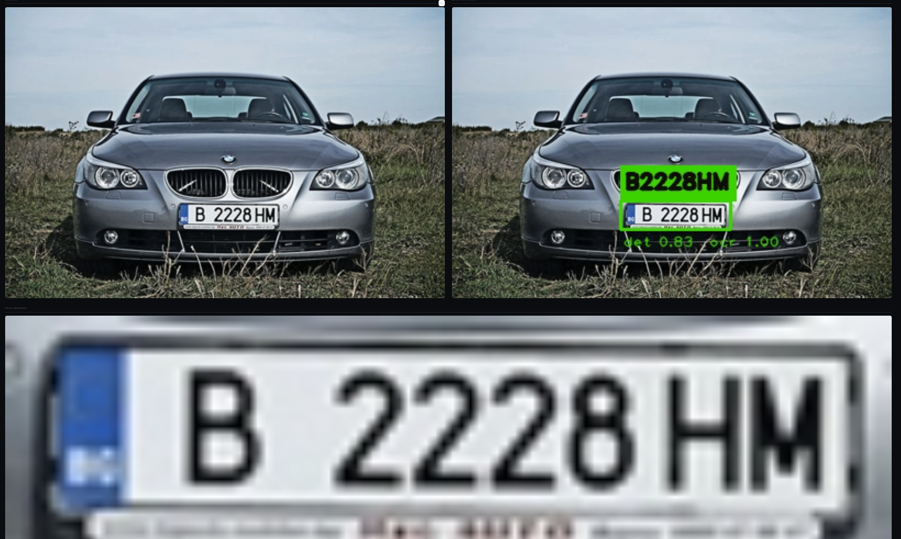
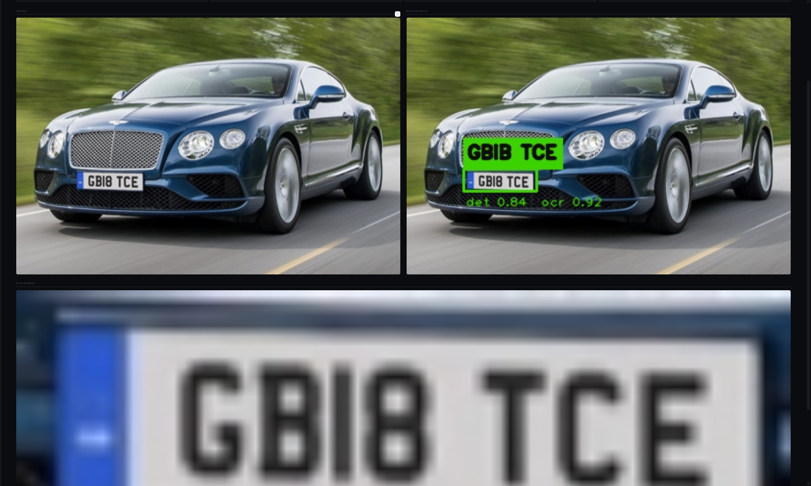
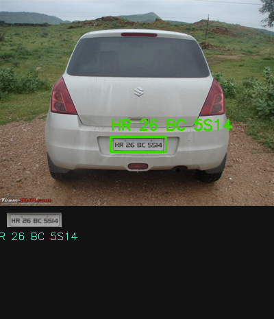
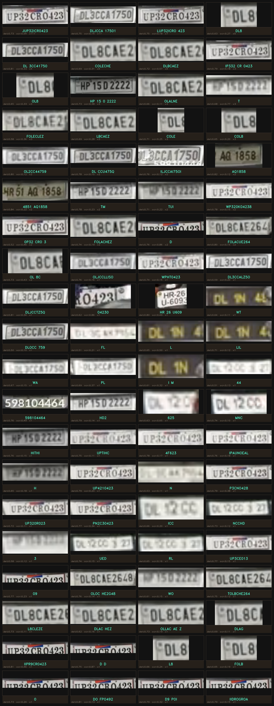
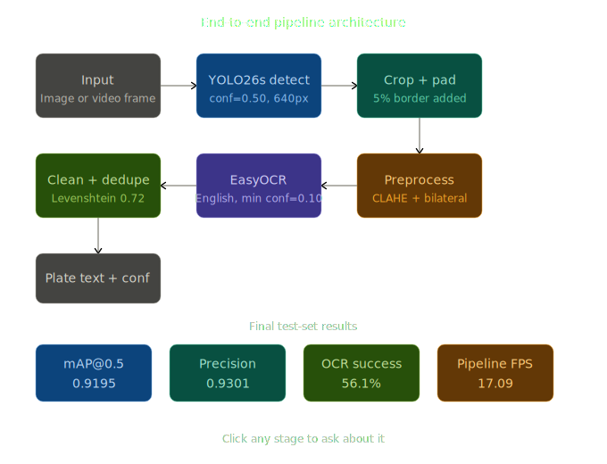

# License Plate Recognition System

> YOLO26s detection · EasyOCR reading · Streamlit deployment  
> Trained on 27,900 images · 17 FPS pipeline · mAP@0.5 = 0.9195 on test set


https://github.com/user-attachments/assets/e0297e4b-33c2-41f2-b4b6-7dba14b0a70d

https://github.com/user-attachments/assets/7ead91b1-baf5-41b9-8896-56f59c0e0f23

https://github.com/user-attachments/assets/342ab842-b945-46a1-8e22-b811fdffe08f

https://github.com/user-attachments/assets/9a3d14cf-30b8-45ef-bbd2-d37c09ac0701


---

## Results at a glance

| Metric | Validation | Test |
|---|---|---|
| mAP @ 0.5 | 0.8691 | **0.9195** |
| mAP @ 0.5:0.95 | 0.4844 | **0.6840** |
| Precision | 0.8598 | **0.9301** |
| Recall | 0.8109 | **0.8438** |
| Pipeline FPS | — | **17.09** |
| Generalisation gap | — | **-0.050** (no overfit) |

---

## Table of contents

- [Overview](#overview)
- [File structure](#file-structure)
- [Quick start](#quick-start)
- [Showcase](#showcase)
- [Pipeline architecture](#pipeline-architecture)
- [Model training](#model-training)
- [Test set evaluation](#test-set-evaluation)
- [Streamlit app](#streamlit-app)
- [Notebook guide](#notebook-guide)
- [Configuration reference](#configuration-reference)
- [Known limitations](#known-limitations)
- [Dependencies](#dependencies)
- [Reproduction steps](#reproduction-steps)

---

## Overview

This project implements a four-stage Automatic License Plate Recognition (ALPR) pipeline:

1. **Detect** — YOLO26s locates plates in images or video frames
2. **Crop** — each detected box is padded and cropped from the original frame
3. **Preprocess** — CLAHE contrast enhancement + bilateral denoising resize to 80px height
4. **Read** — EasyOCR extracts text; video mode clusters noisy reads using Levenshtein similarity

The pipeline is divided into four structured Kaggle notebooks. The test set is sealed until Task 4 to prevent data leakage. The final system is deployable as a Streamlit web app supporting both image and video upload.

---

## File structure

```
license-plate-recognition/
│
├── notebooks/
│   ├── task1_eda.ipynb                  # Dataset exploration and EDA
│   ├── task2_detection.ipynb            # YOLO26n + YOLO26s training
│   ├── task3_ocr_pipeline.ipynb         # OCR pipeline integration
│   └── task4_evaluation.ipynb           # Test set evaluation + error analysis
│
├── deployment/
│   ├── app.py                           # Streamlit web application
│   ├── cell_enhanced_capture.py         # Enhanced video capture cells (Kaggle/Colab)
│   ├── lpr_infer.py                     # Standalone CLI inference script
│   └── requirements.txt                 # Python dependencies
│
└── outputs/                             # Generated at runtime
    ├── plate_detector_best.pt           # YOLO26s champion weights (57.4 MB)
    ├── detection_metrics.json           # Validation metrics (Task 2)
    ├── pipeline_config.json             # OCR config + measured FPS (Task 3)
    ├── final_metrics.json               # Test evaluation results (Task 4)
    ├── plate_captures.png               # Contact sheet of all unique plate crops
    ├── batch_results.csv                # Per-image results table
    │
    ├── viz1_training_curves.png
    ├── viz2_model_comparison.png
    ├── viz3_sample_predictions.png
    ├── viz4_confidence_distribution.png
    ├── viz5_bbox_analysis.png
    ├── viz6_hard_cases.png
    ├── cell1_train_loss.png
    ├── cell6_cm_comparison.png
    ├── preprocessing_comparison.png
    ├── error_analysis_pie.png
    └── detected_<video_name>.mp4
```

---

## Quick start

### Prerequisites

- Python 3.10+
- NVIDIA GPU with CUDA 11.8+ (CPU inference supported but slow)
- `plate_detector_best.pt` weights file

### Install

```bash
git clone https://github.com/your-username/license-plate-recognition.git
cd license-plate-recognition
pip install -r requirements.txt
```

### Run the Streamlit app

```bash
# Place plate_detector_best.pt in the same directory as app.py
streamlit run deployment/app.py
```

Open `http://localhost:8501`. Use the sidebar to set the model path, configure thresholds, and toggle GPU mode.

### Run CLI inference

```bash
# Single image
python deployment/lpr_infer.py path/to/image.jpg

# Video — outputs detected_video.mp4 in the same folder
python deployment/lpr_infer.py path/to/video.mp4 --save output.mp4

# Override detection threshold
python deployment/lpr_infer.py image.jpg --conf 0.40
```

### Kaggle / Colab notebook usage

```python
# After running Task 1–4 notebooks in order, paste these two cells
# from deployment/cell_enhanced_capture.py:

# Cell A — defines all enhanced pipeline functions (run once)
# Cell B — interactive upload and detection

upload_and_detect_enhanced()
```

---

## Showcase

### License Plate Detection & OCR Result

| Scene 1 (Clear Path) | Scene 2 (Medium Range) |
|:---:|:---:|
|  |  |
| **Scene 3 (Complex Background)** | **Scene 4 (Low Angle)** |
|  |  |

*Fig 1: Example of successful plate detection and character recognition across multiple scenarios.*

### Batch Processing & Pipeline Output


*Fig 2: Showcase of multiple vehicle detections and processed plate crops.*

### Unique Plate Captures (Contact Sheet)


*Fig 3: Unique license plates captured and processed by the pipeline.*

### Video Demonstration
Processed video outputs demonstrate the system's real-time performance across various frame rates and lighting conditions.

1.  **[Detection Video Example 1](Output/videos/detected_1,296%20Car%20Number%20Plate%20Stock%20Videos,%20Footage,%20&%204K%20Video%20Clips%20-%20Getty%20Images.mp4)**
2.  **[Detection Video Example 2](Output/videos/lpr_1,314%20Car%20Number%20Plate%20Stock%20Videos,%20Footage,%20&%204K%20Video%20Clips%20-%20Getty%20Images(4).mp4)**

---

## Pipeline architecture



```
Input (image / video frame)
        │
        ▼
┌──────────────────┐
│  YOLO26s detect  │  conf=0.50, imgsz=640
└──────────────────┘
        │  bounding boxes
        ▼
┌──────────────────┐
│  Crop + padding  │  5% border added around each box
└──────────────────┘
        │  plate crop (BGR)
        ▼
┌──────────────────────────────────────┐
│  Preprocess                          │
│  → grayscale                         │
│  → CLAHE  clipLimit=2.0  tile=8×8    │
│  → bilateral filter  d=9  σ=75       │
│  → aspect-preserving resize h=80px   │
└──────────────────────────────────────┘
        │  enhanced grayscale crop
        ▼
┌──────────────────────────────────────┐
│  EasyOCR                             │
│  → English model                     │
│  → filter chars with conf < 0.10     │
│  → uppercase + strip non-[A-Z0-9- ]  │
└──────────────────────────────────────┘
        │  cleaned text + confidences
        ▼
┌──────────────────────────────────────┐  video only
│  OCR deduplication                   │ ──────────►
│  Levenshtein similarity ≥ 0.72       │
│  best of cluster = longest text      │
│  × highest (det_conf × ocr_conf)     │
└──────────────────────────────────────┘
        │
        ▼
Output: plate text, det_conf, ocr_conf, crop image
```

---

## Model training
### Dataset

| Split | Images | Labels | Notes |
|---|---|---|---|
| Train | 25,470 | 25,470 | 18 background images |
| Val | 1,073 | 1,073 | Used for epoch evaluation |
| Test | 386 | 386 | Sealed until Task 4 |

Dataset: [fareselmenshawii/large-license-plate-dataset](https://www.kaggle.com/datasets/fareselmenshawii/large-license-plate-dataset)

### Training configuration

| Parameter | YOLO26n | YOLO26s |
|---|---|---|
| Parameters | 2,375,031 | 9,465,567 |
| GFLOPs | 5.2 | 20.5 |
| Epochs | 30 fresh | 30 (resumed epoch 8) |
| Batch | 16 | 16 |
| Image size | 640 | 640 |
| Optimizer | MuSGD lr=0.01 | MuSGD lr=0.01 |
| AMP | Enabled | Enabled |
| Hardware | Kaggle T4 | Kaggle T4 |
| Training time | ~3.6 h | ~4.0 h |

### Validation results

| Metric | YOLO26n | YOLO26s | Delta |
|---|---|---|---|
| mAP @ 0.5 | 0.8534 | **0.8691** | +0.0157 |
| mAP @ 0.5:0.95 | 0.4668 | **0.4844** | +0.0176 |
| Precision | 0.8472 | **0.8598** | +0.0126 |
| Recall | 0.8036 | **0.8109** | +0.0073 |

YOLO26s selected as champion model.

### Checkpoint resume strategy

Kaggle sessions can disconnect after 9–12 hours. The training notebooks use a layered checkpoint system:

- YOLO saves `last.pt` every epoch and `best.pt` on mAP improvement
- A custom callback copies both to `/kaggle/working/` after each epoch
- On reconnect the notebook detects the existing `last.pt` and resumes automatically
- A daemon thread prints a heartbeat every 5 minutes to prevent kernel timeout

---

## Test set evaluation

### Detection — val vs test

| Metric | Validation | Test | Gap |
|---|---|---|---|
| mAP @ 0.5 | 0.8691 | **0.9195** | -0.050 |
| Precision | 0.8598 | **0.9301** | — |
| Recall | 0.8109 | **0.8438** | — |

The negative gap (-0.050) means the model generalises well — test performance is *better* than validation. This indicates the validation split may be slightly harder than test, not that the model overfit.

### End-to-end pipeline error analysis

| Category | Count | Percentage | Description |
|---|---|---|---|
| Successful read | 252 | 56.1% | Plate detected and OCR returned valid text |
| Detection no OCR | 127 | 28.3% | Plate found, OCR returned empty |
| Partial read | 37 | 8.2% | Text shorter than 4 characters |
| No detection | 33 | 7.3% | YOLO did not detect any plate |

The 28.3% detection-no-OCR rate is the primary bottleneck. Root causes:

- Very small plates (under 30px height in source frame) produce crops too blurry for OCR
- Heavy motion blur in video frames corrupts character edges
- Non-standard or novelty fonts not well covered by EasyOCR's English model

---

## Streamlit app

### Sidebar controls

| Control | Default | Effect |
|---|---|---|
| Weights path | `plate_detector_best.pt` | Path to YOLO26s `.pt` file |
| Use GPU | On | Enables CUDA for YOLO and EasyOCR |
| Confidence threshold | 0.50 | YOLO minimum detection score |
| OCR min confidence | 0.10 | Minimum per-character EasyOCR score |
| Crop padding | 0.05 | Fractional border added around each box |
| Process every N frames | 2 | Video skip rate — higher = faster |
| Max frames | 0 (all) | Cap on frames processed per video |

### Image tab

- Accepts: JPG, JPEG, PNG, BMP, WEBP
- Shows four live metrics: plates detected, inference time (ms), mean detection confidence, mean OCR confidence
- Side-by-side original vs annotated image display
- Individual plate crop thumbnails with result cards showing cleaned text, raw OCR, and both confidence scores
- Download annotated image button

### Video tab

- Accepts: MP4, AVI, MOV, MKV
- Shows video metadata before processing: resolution, fps, frame count
- Live preview updates every 15 processed frames with real-time fps counter
- Post-run summary: unique plate texts found, frames with detections, processing speed
- Expandable frame-by-frame results table
- Download processed video button

Models load once per session via `@st.cache_resource` — no re-loading on every interaction.

---

## Notebook guide

Run notebooks in order. Each produces artifacts consumed by the next.

### Task 1 — EDA (`task1_eda.ipynb`)

- Explores the dataset: split sizes, image dimensions, bounding box distributions
- Produces `dataset_summary.json`
- No training occurs

### Task 2 — Detection training (`task2_detection.ipynb`)

- Trains YOLO26n (30 epochs, fresh start)
- Trains YOLO26s (30 epochs, with checkpoint resume protection)
- Evaluates both models on the validation split
- Produces `plate_detector_best.pt`, `detection_metrics.json`, `model_comparison.csv`
- Test set is not touched

### Task 3 — OCR pipeline (`task3_ocr_pipeline.ipynb`)

The fixed version requires replacing the original setup cell. Key bug fixes:

```python
# Fix 1: correct dataset path (was missing the username prefix)
DATASET_DIR = Path('/kaggle/input/datasets/fareselmenshawii/large-license-plate-dataset')

# Fix 2: correct val folder name (was 'valid', dataset uses 'val')
val_img_dir = DATASET_DIR / 'images' / 'val'

# Fix 3: lower OCR confidence threshold (was 0.30, real plates often score 0.10-0.28)
raw_text = ' '.join([t for (_, t, c) in ocr_results if c > 0.10])
```

Produces `pipeline_config.json`.

### Task 4 — Evaluation (`task4_evaluation.ipynb`)

- Unseals the test set for the first time
- Evaluates detection mAP on `split='test'`
- Runs full pipeline on all 386 test images
- Categorises errors: successful, no-OCR, partial, missed
- Produces `final_metrics.json`, `error_analysis_pie.png`
- No model changes after this point

---

## Configuration reference

| Parameter | Default | Rationale |
|---|---|---|
| `CONF_THRESHOLD` | 0.50 | Balances precision (0.93) vs recall (0.84). Lower to 0.40 to recover more plates at the cost of false positives. |
| `OCR_CONF_MIN` | 0.10 | EasyOCR scores many real plate characters at 0.10–0.29. The original 0.30 threshold caused 28% of valid reads to appear empty. |
| `PADDING_RATIO` | 0.05 | 5% padding ensures the crop includes border characters the detection box sometimes clips. |
| `skip_frames` | 2 | Processes every 2nd frame, doubling throughput to ~34 FPS effective with minimal accuracy loss. |
| `similarity_threshold` | 0.72 | Levenshtein cutoff for clustering noisy video OCR reads. Raise to 0.85 for stricter grouping, lower to 0.60 for more aggressive merging. |

---

## Known limitations

- **28.3% detection-no-OCR rate.** Primary causes: very small plates under 30px height, heavy motion blur in video, and non-standard fonts not covered by EasyOCR's English model.
- **mAP@0.5:0.95 of 0.484.** Moderate bounding box localisation precision. Tight box quality affects OCR crop accuracy when plate characters land at the crop edge.
- **Non-Latin scripts.** The EasyOCR English model does not handle Arabic, Chinese, Cyrillic, or other non-Latin scripts. International plates using these scripts will not be read.
- **OCR deduplication uses text similarity only.** Two physically different plates with similar text (e.g. `AB123` and `AB124`) may be incorrectly merged if `similarity_threshold` is too low.
- **Fixed 640×640 input.** Very high-resolution source images benefit from pre-scaling to 640px before inference.

---

## Dependencies

| Package | Min version | Role |
|---|---|---|
| ultralytics | 8.4.0 | YOLO26 detection model |
| easyocr | 1.7.1 | Plate text extraction |
| opencv-python-headless | 4.9.0 | Image/video I/O, CLAHE, bilateral filter, annotation |
| streamlit | 1.32.0 | Web application framework |
| numpy | 1.24.0 | Array operations |
| pandas | 2.0.0 | Results CSV and frame table |
| torch | 2.0.0 | PyTorch backend for GPU inference |
| matplotlib | 3.7.0 | Training curves and visualisation cells |

Install all:

```bash
pip install -r requirements.txt
```

---

## Reproduction steps

To reproduce from scratch on Kaggle:

1. Create a new Kaggle notebook. Add `fareselmenshawii/large-license-plate-dataset` as a data source. Enable GPU T4.

2. Run `task1_eda.ipynb`. Produces `dataset_summary.json` and EDA visualisations. No training.

3. Run `task2_detection.ipynb`. Trains YOLO26n then YOLO26s. If the session disconnects, re-run the same notebook — it detects `last.pt` and resumes automatically. Produces `plate_detector_best.pt` and `detection_metrics.json`.

4. Run the fixed `task3_ocr_pipeline.ipynb` cells (apply the three bug fixes described in the notebook guide). Produces `pipeline_config.json`.

5. Run the fixed `task4_evaluation.ipynb` cells. Unseals the test set, runs full evaluation, produces `final_metrics.json`.

6. For deployment, copy `app.py`, `lpr_infer.py`, `requirements.txt`, and `plate_detector_best.pt` to a local folder:

   ```bash
   pip install -r requirements.txt
   streamlit run app.py
   ```

---

## Licence

Code in this repository is released under the [MIT License](LICENSE).

- Dataset: [Kaggle dataset licence](https://www.kaggle.com/datasets/fareselmenshawii/large-license-plate-dataset)
- YOLO26 weights: [Ultralytics licence](https://github.com/ultralytics/ultralytics/blob/main/LICENSE)
- EasyOCR: Apache 2.0
